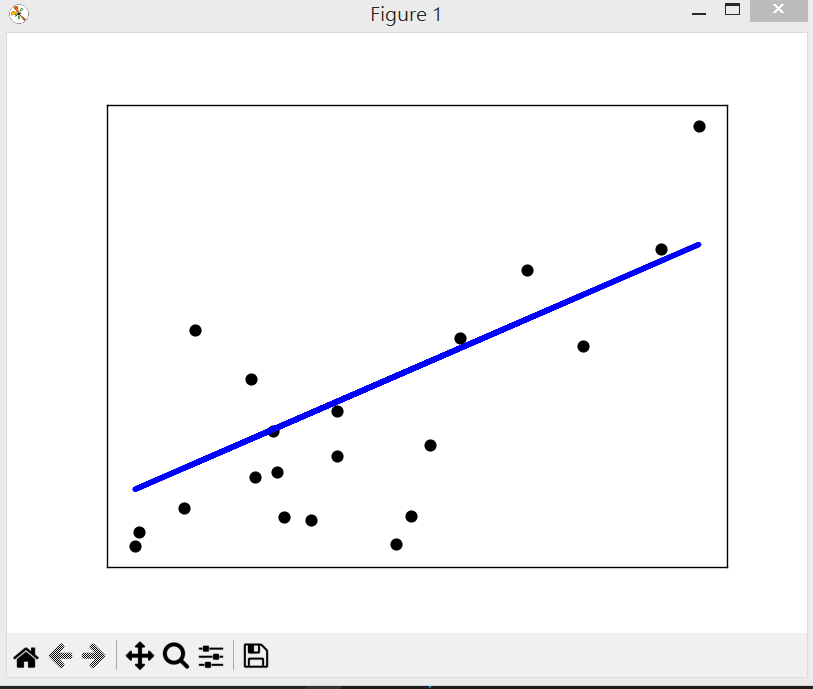

https://chatgpt.com/c/67e37a60-913c-8012-93b5-d27837df0423

```
$ python plot_ols.py
Coefficients:
 [938.23786125]
Mean squared error: 2548.07
Coefficient of determination: 0.47
```



## ccc: diabetes dataset  是什麼？

**Diabetes Dataset**（糖尿病數據集）通常指的是 **Pima Indians Diabetes Database**，這是一個常見的機器學習數據集，用於二元分類問題（判斷某人是否患有糖尿病）。該數據集最初來自美國國家糖尿病、消化與腎病研究所（National Institute of Diabetes and Digestive and Kidney Diseases），主要包含 **Pima 印第安族裔女性** 的健康數據。

---

## **Diabetes Dataset（Pima Indians Diabetes Database）**
- **數據量**：768 筆樣本
- **特徵數量**：8 個輸入特徵
- **標籤**：二元分類（0：無糖尿病，1：有糖尿病）

### **特徵說明（共 8 個）**
| 編號 | 特徵名稱 | 說明 |
|------|----------|------|
| 1 | Pregnancies | 懷孕次數 |
| 2 | Glucose | 血糖濃度（mg/dL） |
| 3 | BloodPressure | 血壓（mm Hg） |
| 4 | SkinThickness | 皮膚皺褶厚度（mm） |
| 5 | Insulin | 胰島素濃度（μU/mL） |
| 6 | BMI | 身體質量指數（kg/m²） |
| 7 | DiabetesPedigreeFunction | 糖尿病遺傳指數 |
| 8 | Age | 年齡（歲） |

### **標籤（Target）**
- **0**：沒有糖尿病
- **1**：有糖尿病

---

## **如何使用 Diabetes Dataset？**
在 **Python（使用 Scikit-learn）** 中，你可以這樣載入此數據集：
```python
from sklearn.datasets import load_diabetes
data = load_diabetes()
print(data.keys())  # 查看數據集結構
```
但是，這個 `load_diabetes()` 來自 **Scikit-learn**，它其實是另一個與糖尿病相關的 **回歸** 數據集，而 **Pima Indians Diabetes Database** 需要從其他來源下載（如 Kaggle 或 UCI ML Repository）。

如果想用 **Pima Indians Diabetes Database**，可以用 Pandas 載入：
```python
import pandas as pd

url = "https://raw.githubusercontent.com/jbrownlee/Datasets/master/pima-indians-diabetes.data.csv"
columns = ["Pregnancies", "Glucose", "BloodPressure", "SkinThickness", "Insulin",
           "BMI", "DiabetesPedigreeFunction", "Age", "Outcome"]

df = pd.read_csv(url, names=columns)
print(df.head())  # 顯示前 5 筆數據
```

---

## **應用領域**
這個數據集經常用於：
- **機器學習分類任務**（如 KNN、SVM、決策樹、神經網絡）
- **特徵工程與數據預處理**（缺失值填補、數據標準化等）
- **醫學研究**（分析影響糖尿病的因素）

---

### **你想用這個數據集做什麼？是用來訓練分類模型，還是分析數據？** 😊

## ccc: 請解說下列程式 ...

這段程式碼使用 **線性回歸（Linear Regression）** 來對 **diabetes** 數據集進行回歸分析，並且可視化結果。以下是詳細解說：

---

## **1. 載入函式庫**
```python
import matplotlib.pyplot as plt
import numpy as np
from sklearn import datasets, linear_model
from sklearn.metrics import mean_squared_error, r2_score
```
- `matplotlib.pyplot`：用來繪製圖表
- `numpy`：數值運算函式庫
- `sklearn.datasets`：載入內建的 diabetes 數據集
- `sklearn.linear_model`：使用線性回歸模型
- `sklearn.metrics`：計算回歸模型的評估指標

---

## **2. 載入 Diabetes 數據集**
```python
diabetes_X, diabetes_y = datasets.load_diabetes(return_X_y=True)
```
- `datasets.load_diabetes(return_X_y=True)`：
  - `diabetes_X`：特徵數據（共有 10 個特徵）
  - `diabetes_y`：目標變數（病人的進行性糖尿病指數）

---

## **3. 選取一個特徵**
```python
diabetes_X = diabetes_X[:, np.newaxis, 2]
```
- 原始 `diabetes_X` 是一個 \( (442, 10) \) 矩陣（442 筆資料，每筆有 10 個特徵）。
- `diabetes_X[:, np.newaxis, 2]`：
  - 這裡選取 **第三個特徵**（索引為 2）。
  - `np.newaxis` 讓它保持二維，變成 \( (442, 1) \)。

這樣做的目的是讓線性回歸在 **2D 平面上可視化**（單變數回歸）。

---

## **4. 分割訓練集與測試集**
```python
diabetes_X_train = diabetes_X[:-20]
diabetes_X_test = diabetes_X[-20:]

diabetes_y_train = diabetes_y[:-20]
diabetes_y_test = diabetes_y[-20:]
```
- 取出最後 **20 筆** 作為測試集（`test set`）。
- 其餘 **422 筆** 作為訓練集（`train set`）。

---

## **5. 建立與訓練線性回歸模型**
```python
regr = linear_model.LinearRegression()
regr.fit(diabetes_X_train, diabetes_y_train)
```
- `linear_model.LinearRegression()`：建立線性回歸模型。
- `.fit(X, y)`：用訓練數據擬合模型。

---

## **6. 進行預測**
```python
diabetes_y_pred = regr.predict(diabetes_X_test)
```
- 使用 `X_test` 預測 `y_pred`（預測的糖尿病指數）。

---

## **7. 輸出模型結果**
```python
print("Coefficients: \n", regr.coef_)
print("Mean squared error: %.2f" % mean_squared_error(diabetes_y_test, diabetes_y_pred))
print("Coefficient of determination: %.2f" % r2_score(diabetes_y_test, diabetes_y_pred))
```
- **回歸係數（slope）**：
  - `regr.coef_`：顯示線性回歸的斜率（權重）。
- **均方誤差（MSE, Mean Squared Error）**：
  - `mean_squared_error(y_true, y_pred)`：衡量預測值與實際值的均方誤差（數值越小越好）。
- **決定係數（\( R^2 \) Score）**：
  - `r2_score(y_true, y_pred)`：衡量模型的解釋能力（接近 1 表示擬合度高）。

---

## **8. 繪製結果**
```python
plt.scatter(diabetes_X_test, diabetes_y_test, color="black")
plt.plot(diabetes_X_test, diabetes_y_pred, color="blue", linewidth=3)

plt.xticks(())
plt.yticks(())

plt.show()
```
- **黑色點（scatter plot）**：實際數據點（`diabetes_X_test`, `diabetes_y_test`）。
- **藍色線（plot）**：線性回歸的預測結果。

這樣就能在 2D 平面上看到 **回歸線的擬合情況**。

---

## **總結**
這段程式碼：
1. **載入** `diabetes` 數據集，並選擇其中一個特徵。
2. **分割** 訓練集與測試集。
3. **建立** 線性回歸模型並 **訓練**。
4. **預測** 測試集的值，並計算 **模型性能指標**。
5. **繪製** 迴歸線與測試數據點，直觀顯示結果。

---

### **改進方向**
如果你想讓結果更準確：
1. **使用所有特徵**，而不是只用一個特徵（這樣會變成多元線性回歸）。
2. **進行特徵工程**，例如標準化數據、移除異常值等。
3. **換成非線性回歸模型**，如果數據分佈非線性。

---

如果你有進一步的問題或想要改進這段程式碼，可以告訴我 😊

## ccc: diabetes_X = diabetes_X[:, np.newaxis, 2], 這個特徵代表什麼意義？

在程式碼中，`diabetes_X = diabetes_X[:, np.newaxis, 2]` 選取了 **Scikit-learn** 提供的糖尿病數據集（Diabetes Dataset）中的第三個特徵（索引為 2）。根據 Scikit-learn 的官方文件，該數據集的特徵名稱如下：

1. `age`：年齡（以年為單位）
2. `sex`：性別
3. `bmi`：身體質量指數（Body Mass Index，BMI）
4. `bp`：平均血壓（Average Blood Pressure）
5. `s1`：總血清膽固醇（Total Serum Cholesterol）
6. `s2`：低密度脂蛋白（Low-Density Lipoproteins，LDL）
7. `s3`：高密度脂蛋白（High-Density Lipoproteins，HDL）
8. `s4`：總膽固醇與 HDL 的比值（Total Cholesterol / HDL）
9. `s5`：可能是血清三酸甘油酯（Triglycerides）的對數值
10. `s6`：血糖值（Blood Sugar Level）

因此，索引 2 對應的特徵是 **`bmi`**，即 **身體質量指數**。 citeturn0search4

需要注意的是，Scikit-learn 的糖尿病數據集中的特徵值已經過標準化處理，因此 `bmi` 的數值並非原始的 BMI 值，而是經過均值為 0、方差為 1 的標準化數據。 citeturn0search0 